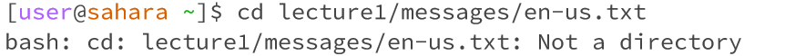

# lab report 1
## `cd`
**cd with no argument**

The working directory is the home directory, which is usually represented by `/`

Since `cd` is executed without any arguments, the user is still returned to the home directory. 

There is no any error in this case. 

**cd with a path to a directory as an argument**

The working directory when the command was run is the home directory `/`

Since the `cd` is used to switch the current working directory to the given path, the output should show that the working directory becomes ~/lecture1

There is no any error in this case.

**cd with a path to a file as an argument**

The working directory when the command was run is the home directory `/`

There is a not a directory error in this case, since `cd` is used to switch the directory to another directory. However, a file itself cannot be considered as a directory. Therefore, there would not be an output. 

## `ls`
**ls with no argument**

The working directory when the command was run is the home directory `/`

Since the `ls` list the files and folders the given path, and the given path is home directory, the output would be the only folder "lecture1" under the given path. 

There is no error in this case. 

