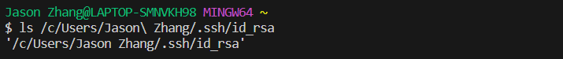
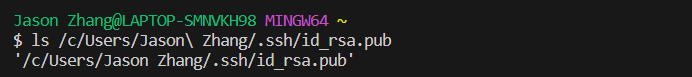
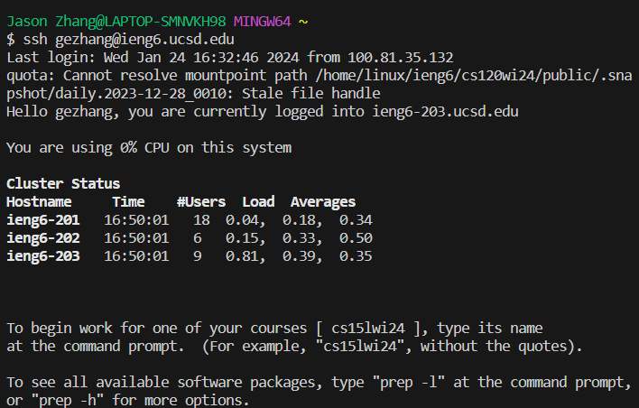

# lab report 2
## part 1 
`import java.io.IOException;`
`import java.net.URI;`

class CHandler implements URLHandler {
    String chatHistory = "";

    public String handleRequest(URI url) {
        if (url.getPath().equals("/add-message")) {
            String query = url.getQuery();
            String user = null;
            String message = null;
            if (query != null) {
                String[] params = query.split("&");
                message = params[0].substring(params[0].indexOf("=") + 1).replace("+", " ");
                user = params[1].substring(params[1].indexOf('=') + 1).replace("+", " ");
            }
            if (user != null && message != null) {
                chatHistory += user + ": " + message + "\n";
            }
            return chatHistory;
        }
        return "Invalid request";
    }
}

`class ChatServer {
    public static void main(String[] args) throws IOException {
        if (args.length == 0) {
            System.out.println("Missing port number! Try any number between 1024 to 49151");
            return;
        }

        int port = Integer.parseInt(args[0]);
        Server.start(port, new CHandler());
    }
}`
## part 2 
The absolute path to the private key

The absolute path to the public key

A terminal interaction where I log into my  `ieng6` accout without being asked for a password

## part 3

I think I learned a lot of things in these two weeks of lab that I didn't know before. The first thing was to create a new web server with my own code. secondly, I learned that `ssh` allows me to log into a remote account. Another thing I learned is that I can use `url` to make information from certain websites appear directly on my end instead of having to go to that website and search for it.
