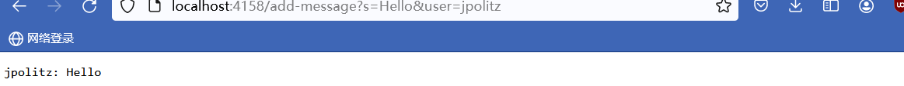
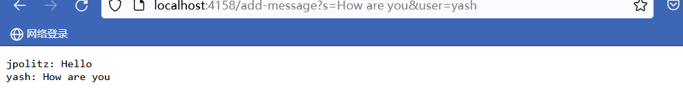

# lab report 2
## part 1 
the code of the CharServer is shown below:

```
import java.io.IOException;
import java.net.URI;

class CHandler implements URLHandler {
    String Information = "";`

    public String handleRequest(URI url) {
        if (url.getPath().equals("/add-message")) {
            String query = url.getQuery();
            String user = null;
            String message = null;
            if (query != null) {
                String[] params = query.split("&");
                message = params[0].substring(params[0].indexOf("=") + 1).replace("+", " ");
                user = params[1].substring(params[1].indexOf('=') + 1).replace("+", " ");
            }
            if (user != null && message != null) {
                Information += user + ": " + message + "\n";
            }
            return Information;
        }
        return "Invalid request";
    }
}

class ChatServer {
    public static void main(String[] args) throws IOException {
        if (args.length == 0) {
            System.out.println("Missing port number! Try any number between 1024 to 49151");
            return;
        }

        int port = Integer.parseInt(args[0]);
        Server.start(port, new CHandler());
    }
}
```
The first task:
 <br>
the method that is called would be `public String handleRequest(URI url)`
the relevant argument would be the `url (http://localhost:4158/add-message?s=Hello&user=jpolitz)`. Moreover, I have created several fields `Information`, `query`, `user`, `message`, `params`. Since the values of these fields are totally depended on the argument I put in, the value of them would definitely changed. In this case, `user` is updated to `jpolitz`, `message` is updated to `Hello`. Also, since `Information` is composed by `message` and `user`, the `Information` is updated to `jpolitz: Hello`, which is the return value of this method and can be seen from the screenshot.

The second task:
 <br>
the method that is called would still be `public String handleRequest(URI url)`
the relevant argument would be the `url(http://localhost:4158/add-message?s=How are you&user=yash)`. The names of the fields are the same. However, the value of them would be change. First of all, the `user` would be changed to `yash` and the `message` would be changed to `How are you`. Since the `Information += user + ": " + message + "\n";`, the previous `jpolitz: Hello` will be preserved and `yash: How are you` will be added to the `Information`. Therefore, the final value of `Information` would be `jpolitz: Hello /n yash: How are you`

## part 2 
The absolute path to the private key <br>


The absolute path to the public key <br>


A terminal interaction where I log into my  `ieng6` accout without being asked for a password <br>


## part 3

I think I learned a lot of things in these two weeks of lab that I didn't know before. The first thing was to create a new web server with my own code. Secondly, I learned that `ssh` allows me to log into a remote account. Moreover, I learned how to use `mkdir` and `scp` to copy the public and private key into my local computer. In this case, when I need to logo onto the `ieng6`, I do not need to type my password again. Another thing I learned is that I can use `curl` to make information from certain websites appear directly on my ternimal instead of having to go to that website and search for it. These are several very important things I learned. 
