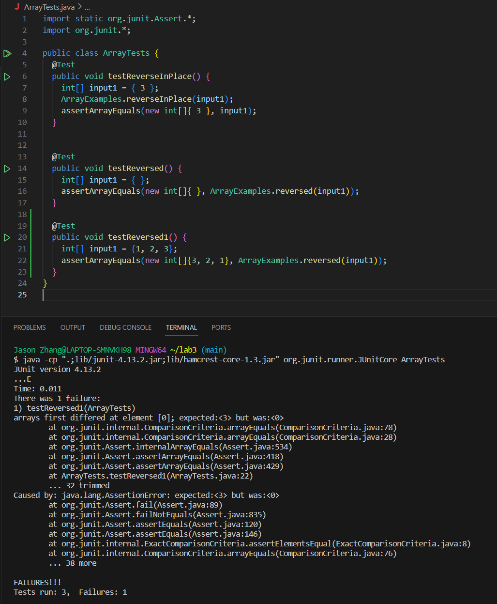

# labreport 3
## Part 1: bug
1. failed-inducing <br>
 `int[] input1 = new int[]{1, 2, 3};` would lead to a failure, the specific code for JUnit test is shown below <br>
 ```
  @Test
  public void testReversed1() {
    int[] input1 = {1, 2, 3};
    assertArrayEquals(new int[]{3, 2, 1}, ArrayExamples.reversed(input1));
  }
```
<br>

2. An input that doesn't induce a failure <br>
`int[] input1 = {};` would not lead to a failure, since the input array is empty array. The specific code for JUnit test is shown below <br>

```
@Test
  public void testReversed() {
    int[] input1 = { };
    assertArrayEquals(new int[]{ }, ArrayExamples.reversed(input1));
  }
```
<br>

3. The symptom, as the output of running the tests <br>
 <br>

the message shows that the first element for the expected array would be 3, but it was 0. In this way, we can say that the code doesn't reverse the array like we expect. 

4. The bug, as the before-and-after code change required to fix it <br>

the code with bug: <br>

```
static int[] reversed(int[] arr) {
    int[] newArray = new int[arr.length];
    for(int i = 0; i < arr.length; i += 1) {
      arr[i] = newArray[arr.length - i - 1];
    }
    return arr;
  }
```

the code without bug: <br>

```
static int[] reversed(int[] arr) {
    int[] newArray = new int[arr.length];
    for(int i = 0; i < arr.length; i += 1) {
      newArray[i] = arr[arr.length - i - 1];
    }
    return newArray;
  }
```

Since in the previous code with bug, it actually return an array with all elements are 0 instead of the reversed array. After changing the last two lines of the code, it return a new array which is the reversed array of the input array. <br>

## Part 2 - Researching Commands <br>
1. `-type` <br>
 example 1:
```
$ find ./technical/ -type d
./technical/
./technical/911report
./technical/biomed
./technical/government
./technical/government/About_LSC
./technical/government/Alcohol_Problems
./technical/government/Env_Prot_Agen
./technical/government/Gen_Account_Office
./technical/government/Media
./technical/government/Post_Rate_Comm
./technical/plos
```

this example shows how to use `-type d` on `./technical`, it would return all the directories under `./technical`. This is because the `d` after `type` means directories. This would be very useful when we want to know how many directories we have under specific directories. <br>
<br>
  example 2: 
 ```
$ find ./technical/ -type f | head -n 10
./technical/911report/chapter-1.txt
./technical/911report/chapter-10.txt
./technical/911report/chapter-11.txt
./technical/911report/chapter-12.txt
./technical/911report/chapter-13.1.txt
./technical/911report/chapter-13.2.txt
./technical/911report/chapter-13.3.txt
./technical/911report/chapter-13.4.txt
./technical/911report/chapter-13.5.txt
./technical/911report/chapter-2.txt
```
this example shows how to use `-type d` on `./technical`, it would return all the files in `./technical`. This is because the `f` after `-type` means file. Since there are too many files, I use `| head -n 10` to get the first 10 files. This would  be very useful when we want to know how many files we have under certain directories<br>
<br>
2. `-size` <br>
 example 1: <br>
 ```
$ find ./technical/ -size +100k
./technical/911report/chapter-1.txt
./technical/911report/chapter-12.txt
./technical/911report/chapter-13.2.txt
./technical/911report/chapter-13.3.txt
./technical/911report/chapter-13.4.txt
./technical/911report/chapter-13.5.txt
./technical/911report/chapter-3.txt
./technical/911report/chapter-6.txt
./technical/911report/chapter-7.txt
./technical/911report/chapter-9.txt
./technical/biomed/1471-2105-3-2.txt
./technical/government/About_LSC/commission_report.txt
./technical/government/About_LSC/State_Planning_Report.txt
./technical/government/Env_Prot_Agen/bill.txt
./technical/government/Env_Prot_Agen/ctm4-10.txt
./technical/government/Env_Prot_Agen/multi102902.txt
./technical/government/Env_Prot_Agen/tech_adden.txt
./technical/government/Gen_Account_Office/ai9868.txt
./technical/government/Gen_Account_Office/d01376g.txt
./technical/government/Gen_Account_Office/d01591sp.txt
./technical/government/Gen_Account_Office/d0269g.txt
./technical/government/Gen_Account_Office/d02701.txt
./technical/government/Gen_Account_Office/gg96118.txt
./technical/government/Gen_Account_Office/GovernmentAuditingStandards_yb2002ed.txt
./technical/government/Gen_Account_Office/im814.txt
./technical/government/Gen_Account_Office/May1998_ai98068.txt
./technical/government/Gen_Account_Office/pe1019.txt
./technical/government/Gen_Account_Office/Sept27-2002_d02966.txt
./technical/government/Gen_Account_Office/Statements_Feb28-1997_volume.txt
```
this example shows how to use `- size ` to find the files that are larger than 100k. Sometimes, when we need to find the large file, this would be very useful.<br>
<br>
 example 2:
 ```
$ find ./technical/ -size -1k
./technical/
./technical/911report
./technical/biomed
./technical/government
./technical/government/About_LSC
./technical/government/Alcohol_Problems
./technical/government/Env_Prot_Agen
./technical/government/Gen_Account_Office
./technical/government/Media
./technical/government/Post_Rate_Comm
./technical/plos
```
this example shows how to use `- size ` to find the files that are smaller than 1k. Sometimes, when we need to find the small file, this would be very useful.<br>
<br>

3. `-maxdepth` <br>
 example 1: <br>
 ```
$ find ./technical/ -maxdepth 1
./technical/
./technical/911report
./technical/biomed
./technical/government
./technical/plos
```
This example examines the files and directories that are directly within the specified path and within 1 subdirectories. It would be quite helpful when we want to know how many subdirectories and files are within specific depth.<br>
<br>

 example 2: <br>
 ```
$ find ./technical/ -maxdepth 2 | head -n 10
./technical/
./technical/911report
./technical/911report/chapter-1.txt
./technical/911report/chapter-10.txt
./technical/911report/chapter-11.txt
./technical/911report/chapter-12.txt
./technical/911report/chapter-13.1.txt
./technical/911report/chapter-13.2.txt
./technical/911report/chapter-13.3.txt
./technical/911report/chapter-13.4.txt
```
This example examines the files and directories that are directly within the specified path and within 2 depth, and the reason to use `| head -n 10` is files and directories within 2 depth are too many.  It would be quite helpful when we want to know how many subdirectories and files are within specific depth.<br>
<br>
4. `-regex`<br>
example 1:<br>
```
$ find ./technical/ -regex ".*chapter.*"
./technical/911report/chapter-1.txt
./technical/911report/chapter-10.txt
./technical/911report/chapter-11.txt
./technical/911report/chapter-12.txt
./technical/911report/chapter-13.1.txt
./technical/911report/chapter-13.2.txt
./technical/911report/chapter-13.3.txt
./technical/911report/chapter-13.4.txt
./technical/911report/chapter-13.5.txt
./technical/911report/chapter-2.txt
./technical/911report/chapter-3.txt
./technical/911report/chapter-5.txt
./technical/911report/chapter-6.txt
./technical/911report/chapter-7.txt
./technical/911report/chapter-8.txt
./technical/911report/chapter-9.txt
```
This example is used to find all the files under `./technical` that have the pattern like `.*chapter.*`. This would be very useful when we need to find a file whose name contains specific word or sign.<br>
<br>

example 2: <br>
```
$ find ./technical/ -regex ".*Comments.*"
./technical/government/About_LSC/Comments_on_semiannual.txt
```
This example is used to find all the files under `./technical` that have the pattern like `.*Comments.*`. This would be very useful when we need to find a file whose name contains specific word or sign.<br>

<br>
<br>
<br>
<br>
## Citation: the prompt I gave to ChatGPT: <br>
<br>
most common 5 command-line options for "find" except name.<br>
the outputs shows the four options I include in this report and `atime`. However, I don't really understand the `atime`. So, I choose another 4. <br>
<br>
explain more clearly about how to use `-regex`<br>
Since I don't really understand the brief introduction about the option given by chat-GPT, I asked it to provide more detailed explanation<br> 
<br>
explain more about the `-maxdepth`.<br>
Since I don't know the exact meaning of maxdepth, I asked gpt to give me a very comprehensive definition about it. 


   


   
