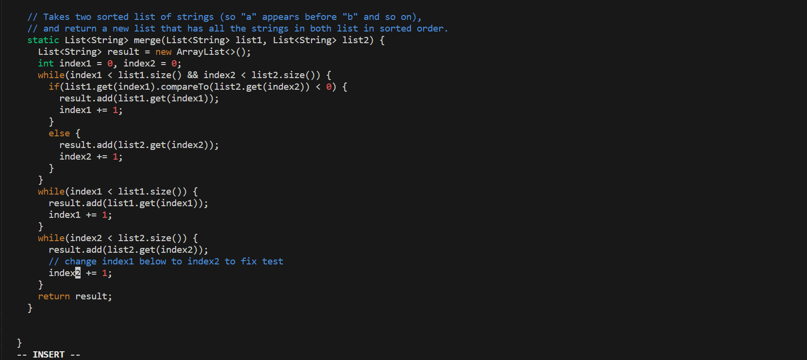

# lab report 4
## step 4

key pressed: `ssh<space>gezhang@ieng6-202.ucsd.edu<enter>`. 
This line is used to help me to log into ieng6 with the help of typing my own account followed by `ssh`. 
## step 5 

key pressed: `git<space>clone<space>git@github.com:ZGXJason/lab7.git<enter>`. 
This line is used to clone everything in `lab7` from my github to the remote accout. `git@github.com:ZGXJason/lab7.git` is the `SSH` URL for the `lab7` of my fork.  
## step 6

key pressed:  
`cd<space>la<tab><enter>` 
`ls<enter>` 
`bash<space>te<tab>` 
In order to run the test, I have to first change my directory to the `lab7`, and that is the reason I pressed `cd<space>la<tab><enter>`. Since there is only one directory begin with letter `la`, I only need to press `la` then press `<tab>`. After that, in order to find the file for the test, I have to list all the files, that is the reason I pressed `ls<enter>`. Then, in order to run the test, I pressed `bash<space>te<tab>`. Also, since there is only one file begin with letter `te`, I only need to press `bash<space>te<tab><enter>`. After that, the test would run, and show there is an error. 
## step 7

 
key pressed:  
`vim<space>ListExamples.java<enter>` 
This command line is used to open the `ListExamples.java` file in the terminal. 
`i` 
This is used to change to insert mode which can allow us to change the code in the terminal.  
After that, we can located to the last `while` loop, and change the `index1` to `index2`. Then pressed `esc` to change to normal mode. 
`:wq` 
This is used to save our change in that file and quit to the terminal 
## step 8
 
key pressed: 
`bash<space>te<tab><enter>`. 
Also, since there is only one file begin with letter `te`, I only need to press `bash<space>te<tab><enter>`. After that, the result shows all tests passed. 
## step 9
 
key pressed: 
`git<space>add<space>.<enter>` 
In order to add all change, `.` can help us to do that.   
`git<space>commit<space>-m<space>"my own commit"<enter>` 
Commit all the change and make the commit message as "my own commit". 
`git<space>push<space>origin<space>main<enter>` 
Since the `lab7` is in the `main` branch on my github, I added `origin<space>mian` after the `git<space>push<space>` to do that. 

