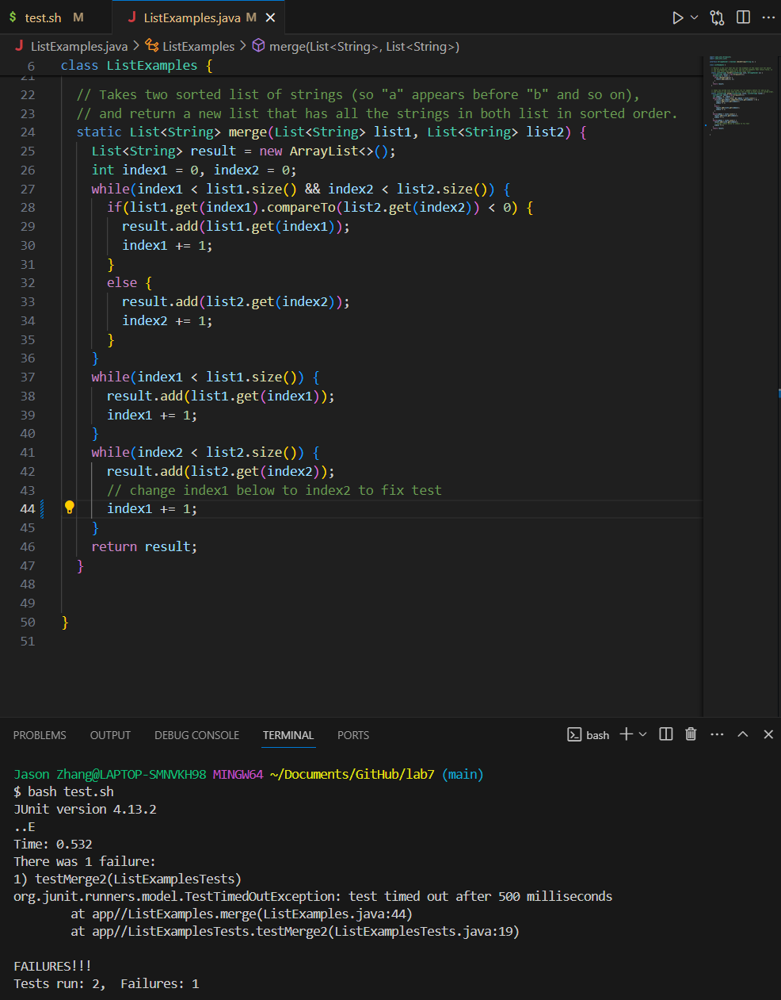
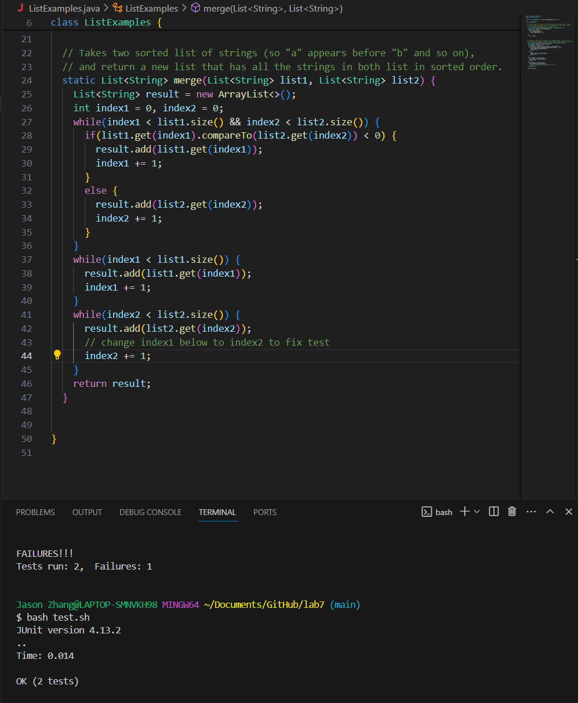
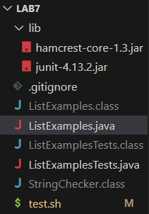
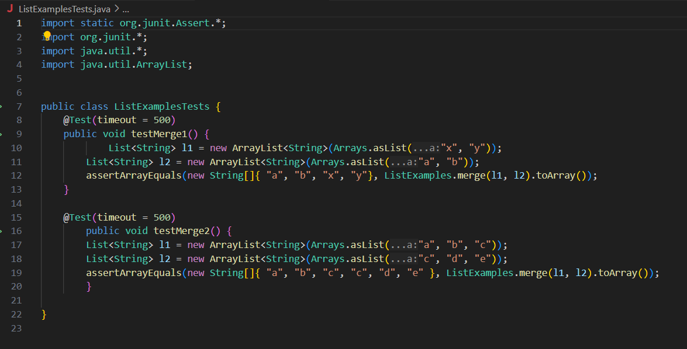
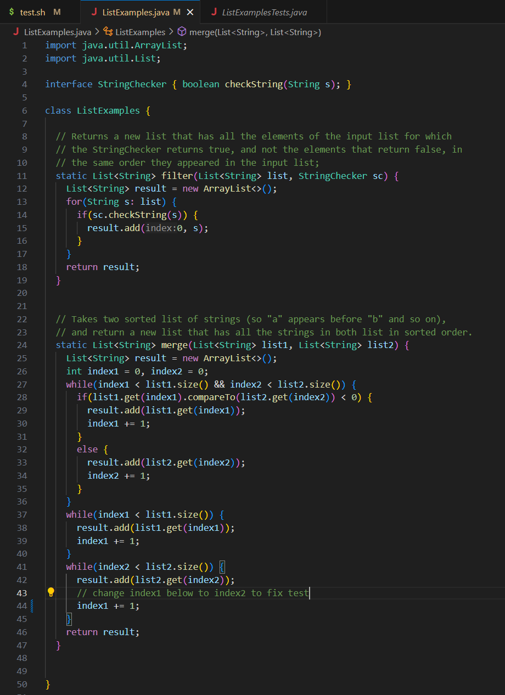
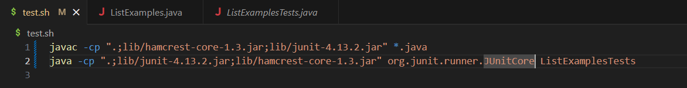

# lab report 5
## part 1 
The student post: 
I am testing my ListExamples.java merge method on ListExamplesTests.java. However, one failure message appeared on the terminal regarding a Timeout Exception. I guess this might be caused by some of the local variable haven't be updated. Here's a screenshot of the output and corresponding code.
  
 
The TA response: 
Jason Zhang: try to replace the `index1` into `index2` in the last `while - loop`.  
 
After changing the code and the description of the bug:  
The third while loop in the original code tries to add the remaining elements from `list2` to the result arraylist. However, this while loop checks to see if `index2` is smaller than the arraylist's size. The original code includes a line `index+=1`;, which increments `index1` each time the condition is met. As a result, the while loop runs indefinitely because `index2` never changes. Instead of incrementing `index1`, `index2` should be incremented by `index2+=1`; this ensures that the code behaves correctly.
  
 
Setup: 
The file & directory structure needed are in lab7: 
  
The content of each file before fixing the bug: 
`ListExamplesTests.java` 
  
`ListExamples.java` 
  
`test.sh`
  
The description of fixing the bug: 
Change `index+=1` in the final while loop to `index+=2` to properly add elements from `list2` to the result arraylist and keep the loop from running indefinitely.

## part 2
The most useful thing I learned was how the gradescope operates internally. GradeScope uses scripts/shell files with meaningful command lines to evaluate student code and assign scores based on its behavior. I'm not sure how Gradscope tests our code and assigns us grades before we attend lectures and labs (I initially assumed instructors were using magical commands or were behind the screen manually running our codes). Knowing how it works gave me a better understanding of how my programming assignments are evaluated, as well as inspiration for creating meaningful and effective test cases on my own. It's great to understand the entire process behind the scenes.
